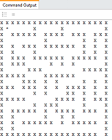

# Breadth-First Search



## Introduction

The goal of this assignment is to find your way out of a maze using breadth-first search.

Before you begin, make sure that you are completely comfortable with classes and methods in python, 
and the idea of instances. The OO ideas in python are conceptually very similar to OO in Java, but the 
syntax is different. Our python tutorial at the start of the semester introduced OO in python (classes, methods, 
constructors, ...) at the very bottom. Take a look at it again for a refresher. Ask clarification questions 
on our Discord server. (There is no stupid question, especially if this is your first time programming in python, 
or using python with OO.)

Recall one basic algorithm for breadth-first search (BFS) in an unweighted (all step costs = 1) graph:

```
bfs(start vertex, goal vertex):
  make frontier an empty queue
  enqueue start onto frontier
  until frontier is empty
    dequeue parent off frontier
    for each undiscovered child of parent
      enqueue child onto frontier
      stop if child is the goal
```

To apply this algorithm to a maze (see picture at top), 
think of grid locations as vertices. The "children" of a grid location are the open cells adjacent to it 
in the four cardinal directions (north, south, east, west).

## Implementation

In the starter code for you in `bfs_maze.py`, a `Maze` class and an `Agent` class have been started for you. 
Once you complete the indicated methods, you will be able to watch the agent navigate the maze. 
Adjust the height of your console/PyCharm window to match the maze height, 
so that each display appears in the same place each tick.

In this implementation, let's represent possible moves (the four cardinal directions) 
using the strings `'N', 'S', 'E', 'W'`.

After completing the three methods marked "YOU FILL THIS IN", your `bfs_maze.main` driver method 
should work. Simulate the maze by executing the `main` (similar to HW0).

How does the code work? Take a long look at the methods in the starter code, the arguments they accept, 
and the values they return. This is sort of like a big puzzle to figure out. Also consult the 
`bfs_maze_tester.py` file for example method calls to be better understand the values that should be 
returned.

**Algorithm notes:**

- You will need to keep track of the sequence of moves by which you discovered each location. 
  The pseudocode above doesn't address this, so the way you do it is up to you.

**"More Advanced" Python notes:**

- (Feel free to ignore this if it is not applicable to your implementation.) 
  If you want to put Maze objects into sets or use them as dictionary keys, 
  remember to overload the `__hash__` and `__eq__` and `__ne__` methods of the `Maze` class.

## Autograding / Testing

Keep your BFS maze implementation program named `bfs_maze.py`. 

There are three functions that I'll be testing:

1. `moves`(4 test methods x 5 pts = 20 pts)
2. `neighbor`(3 test methods x 5 pts = 15 pts)
3. `bfs`(5 test methods x 8 pts = 40 pts)

The pytest methods are located in `bfs_tester.py`. Execute the pytests the same as HW0. Feel free to 
include additional tests as long as you don't overwrite my original tests.

## CSC575 Only:

(25 pts.)

In your submission, also modify your code to output statistics on the time required to solve the maze, 
the number of "nodes" explored, the length of the explored list, etc. 
Empirically measure the time and space costs of running BFS in the maze environment. 
Try running your code on a couple of different mazes. Do your empirical time and space measurements 
seem in agreement with the big-O time and space complexities of BFS? Report and discuss in a 1-2 page writeup.


## Submission Instructions

Submit this assignment by pushing/committing into our GitHub organization, exactly like HW 0. 
Test your project locally 
using pytest before pushing/committing. You may push/commit multiple times. Look at the Actions report on the 
repository to double check the most recent result of the unit tests.


## Acknowledgements

The initial structure for this assignment was motivated by Lisa Torrey's 2016 Model AI Assignments contribution.
